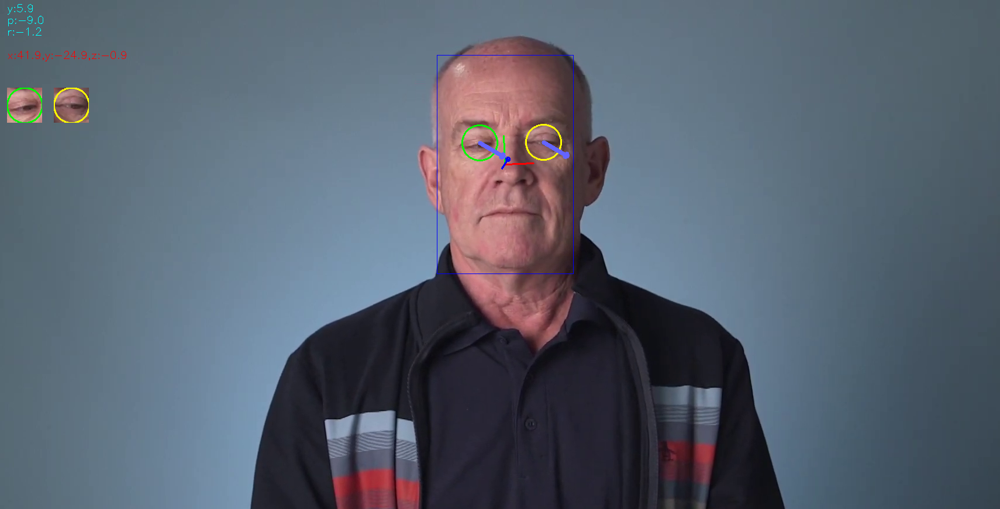

# Computer Pointer Controller

*TODO:* Write a short introduction to your project

| Details            |              |
|-----------------------|---------------|
| Programming Language: |  Python 3.**6** |
| OpenVino Version: |  2020.**2** |
| Models Required: |face-detection-adas-binary-0001   <br /><br />landmarks-regression-retail-0009 <br /><br /> head-pose-estimation-adas-0001 <br /><br />gaze-estimation-adas-0002|
| Hardware Used: |  Intel CPU i7 8th gen|
| Environment Used: |  VMware: Ubuntu 18.1|




## Project Set Up and Installation
### Directory Structure
```

.
├── bin
│   └──  demo.mp4
├── gaze-app.log
├── models
├── README.md
├── requirements.txt
└── src
    ├── face_detection.py
    ├── facial_landmarks_detection.py
    ├── gaze_estimation.py
    ├── head_pose_estimation.py
    ├── inference.py
    ├── input_feeder.py
    ├── main.py
    ├── model.py
    └── mouse_controller.py
```

### Setup
After you clone the repo, you need to install the dependecies using this command
```
pip3 install -r requirements.txt
```
After that you need to download OpenVino required models using `model downloader`.
* face-detection-adas-binary-0001
* landmarks-regression-retail-0009 
* head-pose-estimation-adas-0001 
* gaze-estimation-adas-0002

## Demo

## Run command: 
```
python3 src/main.py -fdm models/intel/face-detection-adas-binary-0001/FP32-INT1/face-detection-adas-binary-0001.xml \
        -lmm models/intel/landmarks-regression-retail-0009/FP16-Int8/landmarks-regression-retail-0009.xml \
        -hpm models/intel/head-pose-estimation-adas-0001/FP16-Int8/head-pose-estimation-adas-0001.xml \
        -gem models/intel/gaze-estimation-adas-0002/FP16-Int8/gaze-estimation-adas-0002.xml \
        -i bin/demo.mp4 \
        -d CPU \
        --print
```

## Documentation

```
usage: main.py [-h] -fdm FDMODEL -hpm HPMODEL -lmm LMMODEL -gem GEMODEL -i
               INPUT [-l CPU_EXTENSION] [-d DEVICE] [-pt PROB_THRESHOLD]
               [--print] [--no_move] [--no_video]

optional arguments:
  -h, --help            show this help message and exit
  -fdm FDMODEL, --fdmodel FDMODEL
                        Path to a face detection xml file with a trained
                        model.
  -hpm HPMODEL, --hpmodel HPMODEL
                        Path to a head pose estimation xml file with a trained
                        model.
  -lmm LMMODEL, --lmmodel LMMODEL
                        Path to a facial landmarks xml file with a trained
                        model.
  -gem GEMODEL, --gemodel GEMODEL
                        Path to a gaze estimation xml file with a trained
                        model.
  -i INPUT, --input INPUT
                        Path video file or CAM to use camera
  -l CPU_EXTENSION, --cpu_extension CPU_EXTENSION
                        MKLDNN (CPU)-targeted custom layers.Absolute path to a
                        shared library with thekernels impl.
  -d DEVICE, --device DEVICE
                        Specify the target device to infer on: CPU, GPU, FPGA
                        or MYRIAD is acceptable. Sample will look for a
                        suitable plugin for device specified (CPU by default)
  -pt PROB_THRESHOLD, --prob_threshold PROB_THRESHOLD
                        Probability threshold for detections filtering(0.5 by
                        default)
  --print               Print models output on frame
  --no_move             Not move mouse based on gaze estimation output
  --no_video            Don't show video window


```

## Benchmarks

### Results for DEVICE = CPU
| Factor/Model       | Face Detection   | Landmarks Detetion        | Headpose Estimation | Gaze Estimation |
|--------------------|---------------|-----------|-------------|-----------|
|Load Time FP32      |  235ms        | 103ms     | 120ms       | 148ms     |
|Load Time FP16      |  NA           | 252ms     | 257ms       | 250ms     |  
|Load Time FP16-INT8 |  NA           | 173ms     | 410ms       | 463ms     |
||||||
|Inference Time FP32 | 8.5ms         | 0.5ms     | 1.1ms       | 1.3ms     |
|Inference Time FP16 | NA            | 0.6ms     | 1.2ms       | 1.4ms     |
|Inference Time FP16-INT8| NA        | 0.5ms     | 0.9ms       | 1.0ms |
||||||

### Results for DEVICE = IGPU
| Factor/Model       | Face Detection   | Landmarks Detetion        | Headpose Estimation | Gaze Estimation |
|--------------------|---------------|-----------|-------------|-----------|
|Load Time FP32      |  530ms        | 250ms     | 297ms       | 364ms     |
|Load Time FP16      |  NA           | 304ms     | 520ms       | 615ms     |  
|Load Time FP16-INT8 |  NA           | 416ms     | 938ms       | 1140ms     |
||||||
|Inference Time FP32 | 34ms         | 1.5ms     | 3.1ms       | 4.2ms     |
|Inference Time FP16 | NA            | 1.9ms     | 3.8ms       | 5.2ms     |
|Inference Time FP16-INT8| NA        | 1.6ms     | 2.8ms       | 3.3ms |
||||||

## Results
* Load model time for GPU us larger than CPU
* Load time for models with FP32 is less than FP16 and the same for FP16 models is less than INT8. 
* Inference time for models with FP32 is larger than FP16 and  Inference time for FP16 models is larger than INT8. 


